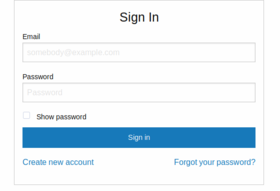
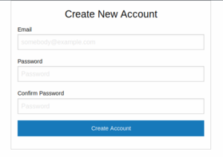

AWS Cognito Javascript Demo
===========================

 

The aim of this project is to demonstrate the use of AWS Cognito for basic client-side authentication using plain Javascript. The features include:

- Sign in
- Sign out
- Create new account
- Reset password
- Display of JWT access token

To test it on localhost, first create a Cognito user pool on your AWS account and enter the user pool details into `js/config.js`. To run the client, execute `npm install` and then `npm start` from the project root directory. 